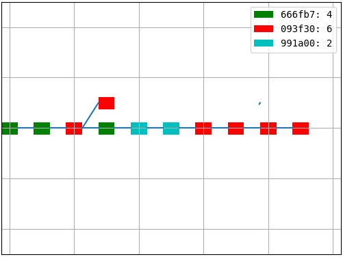
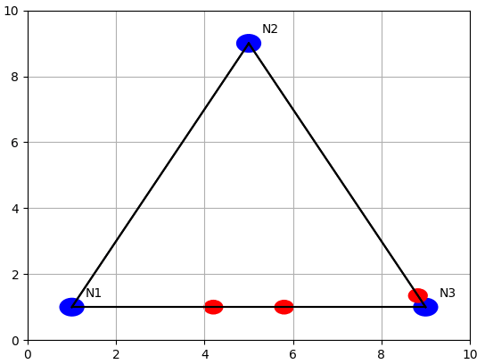
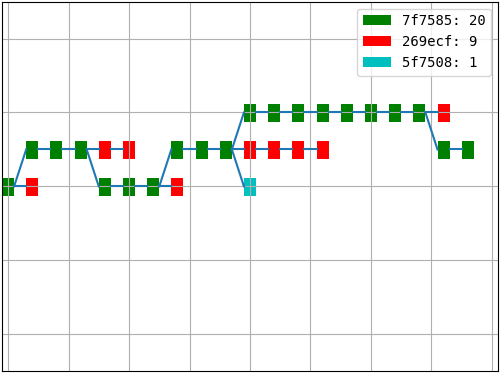
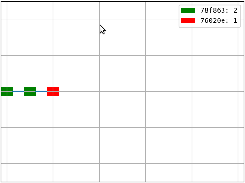
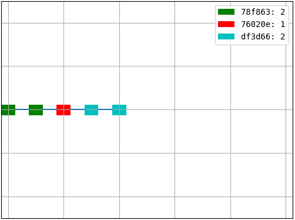
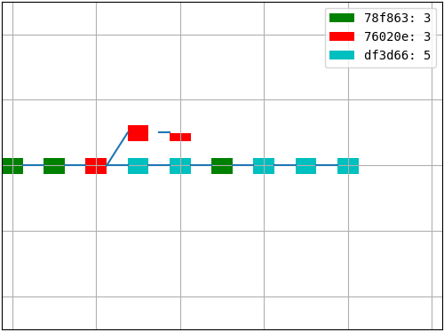
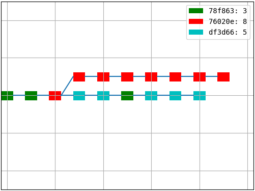

# KMA-Coin

## 1 Giới thiệu

KMA-Coin là một chuỗi khối có thiết kế tối giản với chức năng và luật đồng thuận tương tự Bitcoin. Mục tiêu của KMA-Coin là trở thành một công cụ hữu ích phục vụ học tập và nghiên cứu về Bitcoin và chuỗi khối.

## 2 Tổ chức mã nguồn

KMA-Coin được viết bằng Python 3 nên có mã nguồn ngắn gọn và dễ đọc hiểu. Các thư viện hỗ trợ gồm (ngoài những thư viện sẵn có của Python):
-   [_ecdsa_](https://pypi.org/project/ecdsa/): dùng tạo và kiểm tra chữ ký số.
-   [_matplotlib_](https://matplotlib.org/): dùng tạo các hình ảnh trực quan.

Mã nguồn KMA-Coin được chia làm 4 nhóm:
-   _globaldef_: gồm các định nghĩa về hàm băm, chữ ký số, ... cần được thống nhất trước khi hệ thống được triển khai.
-   _objects_: gồm các thiết kế về đồng tiền, giao dịch, khối, trạng thái.
-   _network_: gồm các thiết kế về mạng, giao thức.
-   _atnode_: gồm các thiết kế cần thiết để vận hành một nút mạng.
    +   _structures_: các cấu trúc dữ liệu như cây khối.
    +   _workers_: những "công nhân" làm việc tại nút. Mỗi công nhân đảm nhận một vai trò khác nhau như xử lý khối, quảng bá đối tượng, giải câu đố băm, gửi/nhận dữ liệu, ...


## 3 Tính năng

### 3.1 Tính linh hoạt

Nhiều mô-đun của KMA-Coin có thể được điều chỉnh, "tháo ra cắm vào" một cách dễ dàng. Điều này cho phép ta linh hoạt triển khai KMA-Coin dưới nhiều phiên bản khác nhau. [_Bảng 1_](#bang_1) tổng hợp lại những thay đổi ta có thể thực hiện lên KMA-Coin.

<a id='bang_1'></a>_Bảng 1: Những thay đổi có thể thực hiện lên KMA-Coin_

|Người dùng có thể ...|Bằng cách ...|
|:--|:--|
|Thay đổi thuật toán hàm băm|Chỉnh sửa mô-đun _globaldef/hash.py_|
|Thay đổi thuật toán chữ ký số|Chỉnh sửa mô-đun _globaldef/signature.py_|
|Thay đổi các thông số về luật đồng thuận như: tần suất công bố khối trung bình, chu kỳ cập nhật độ khó câu đố băm, ...|Chỉnh sửa mô-đun _globaldef/mining.py_|
|Cài đặt các chiến thuật làm việc khác với mặc định|Thêm các mô-đun chiến thuật tự viết vào gói _atnode/workers/miners_|
|Cài đặt thuật toán đồng thuận mới|Chỉnh sửa _objects/block.py_, _objects/xstate.py_ và các mô-đun trong _atnode/workers/miners_|

### 3.2 Ảo hóa tốc độ làm việc

Tốc độ làm việc (thể hiện qua tốc độ băm) của một nút mạng KMA-Coin khi vận hành có thể được ảo hóa. Dĩ nhiên, tốc độ ảo hóa không thể lớn hơn tốc độ thật.


```python
from kmacoin.atnode.workers.miners.lazyminer import LazyMiner
from kmacoin.globaldef.hash import HASH_OF_NULL
from kmacoin.objects.block import Block
from time import time

# add a miner that can perform 10 hashes per second.
miner = LazyMiner(node=None, hash_rate=10)

for i in range(10):
    t1 = time()
    miner.virt_attempt(block=Block(prev_id=HASH_OF_NULL), threshold=HASH_OF_NULL)
    t2 = time()
    print(t2-t1)
```

    0.10009479522705078
    0.1000211238861084
    0.10004186630249023
    0.10000467300415039
    0.10004973411560059
    0.09999275207519531
    0.09999251365661621
    0.1000814437866211
    0.09999489784240723
    0.10006475448608398


Có thể thấy, khi nút có tốc độ băm là 10 H/s thì sai số tương đối không vượt quá 1/1000. Nhìn chung, độ chính xác ảo hóa càng cao khi tốc độ băm càng nhỏ.

### 3.3 Ảo hóa độ trễ truyền dẫn

KMA-Coin hỗ trợ ảo hóa độ trễ truyền dẫn trên liên kết giữa 2 nút mạng bất kì. Dĩ nhiên độ trễ ảo hóa không thể nhỏ hơn độ trễ thật. Tính năng này cộng với tính năng trước đó (ảo hóa tốc độ làm việc) cho phép toàn mạng KMA-Coin có thể được mô phỏng chỉ bằng một chiếc máy tính cá nhân duy nhất.


```python
from kmacoin.network.kmasocket import KMASocket
from time import time, sleep
import threading

# the server socket's listening address 
ADDRESS = ('localhost', 6666)

# virtual latency of 2 nodes depends on their virtual locations
LOC1 = (0.0, 0.0)
LOC2 = (0.0, 10.0)

# server-side code:
def serve(server_socket):
    s, _ = server_socket.accept()
    print("Server received: {}".format(s.recv(256).decode()))
    s.sendall(b"Hi!")

server_socket = KMASocket(LOC1)  
server_socket.bind(ADDRESS)
server_socket.listen()
threading.Thread(target=serve, args=(server_socket,)).start()

# client-side code:
client_socket = KMASocket(LOC2)
client_socket.connect(ADDRESS)
client_socket.sendall(b"Hello from client!")

# time measured:
t1 = time()
print("Client received: {}".format(client_socket.recv(256).decode()))
t2 = time()
print("Total round trip time: {}".format(t2 - t1), end=' ')
print("(expected: {})".format(2 * KMASocket.get_latency(LOC1, LOC2)))

# cleaning up
server_socket.close()
client_socket.close()
```

    Server received: Hello from client!
    Client received: Hi!
    Total round trip time: 2.00407338142395 (expected: 2.0)


### 3.4 Hình ảnh trực quan

KMA-Coin hỗ trợ hiển thị hình ảnh cây khối (mô-đun _atnode/workers/blockvisualizer.py_) như trong [_Hình 1_](#hinh_1), và các hoạt động trên mạng ngang hàng (mô-đun _network/visualizing.py_) như trong [_Hình 2_](#hinh_2). Điều này giúp chúng ta có cái nhìn trực quan hơn về những gì đang xảy ra trong hệ thống.

|<a id='hinh_1'></a> |
|:--|
|_Hình 1: Hình ảnh hóa cây khối_|

|<a id='hinh_2'></a> |
|:--|
|_Hình 2: Hình ảnh hóa các hoạt động trên mạng ngang hàng_|

## 4 Cài đặt và sử dụng

Các bước cơ bản để cài đặt và sử dụng KMA-Coin gồm (các ví dụ được thực hiện trên hàng lệnh Linux):

1. Cài đặt các thư viện hỗ trợ (_ecdsa_ và _matplotlib_):
    ```console
    pip3 install ecdsa
    pip3 install matplotlib
    ```

2. Tải mã nguồn KMA-Coin về:
    ```console
    git clone https://github.com/nguyenduyhieukma/kmacoin.git
    ```

3. Nhảy vào thư mục _kmacoin_ vừa tải về:
    ```console
    cd kmacoin
    ```
    
4. Thay đổi số lượng nút và cấu hình mỗi nút bằng cách chỉnh sửa tập tin *nodes_conf.py* (các thông số cấu hình thường dùng được trình bày trong [_Bảng 2_](#bang_2):
    ```console
    nano nodes_conf.py
    ```
    
5. Bắt đầu thực hiện mô phỏng bằng cách thực thi mô-đun _kmacoin.py_:
    ```console
    python3 kmacoin.py
    ```

<a id='bang_2'></a> _Bảng 2: Các thông số cấu hình cho một nút mạng KMA-Coin thường dùng_

|Thông số|Ý nghĩa|Giá trị mặc định|
|:--|:--|:--|
|`NAME`|Tên nút|N1, N2, ...|
|`VIRTUAL_LOCATION`|Vị trí ảo của nút|Một giá trị sinh ngẫu nhiên|
|`LISTENING_ADDRESS`|Địa chỉ lắng nghe kết nối|Rỗng (nút sẽ không lắng nghe kết nối)|
|`PUBLIC_ADDRESS`|Địa chỉ lắng nghe được quảng bá|Rỗng (nút sẽ không quảng bá địa chỉ lắng nghe của mình nếu có)|
|`INITIAL_PEER_ADDRESSES`|Địa chỉ lắng nghe kết nối của các nút khác (cần để gia nhập mạng)|Rỗng (nút không kết nối với ai và tự xem mình là thành viên đầu tiên trong mạng)|
|`MINER_MODULE`|Mô-đun làm việc được gắn cho nút|_lazyminer_. Mô-đun này sẽ làm việc một cách trung thực|
|`HASH_RATE`|Tốc độ làm việc hay tốc độ băm của nút, tính bằng số hàm băm thực hiện trên một giây (H/s)|10 H/s|
|`DATA_DIRECTORY`|Thư mục lưu trữ dữ liệu (khối, khóa bí mật, ...) cho nút|*<Thư mục hiện tại>/kmacoin_root/<tên nút>*|
|`OWNER_ACCOUNT`|Một khóa công khai xác định chủ sở hữu của tất cả tiền thưởng công bố khối (nếu có) của nút|Một giá trị sinh ngẫu nhiên|
|`VERBOSE`|Quyết định nút có in thông tin ra màn hình trong lúc làm việc hay không|True|

## 5 Mô phỏng tấn công 51% - đóng băng hệ thống

### 5.1 Kiến trúc triển khai

Mạng ngang hàng gồm 3 nút N1, N2, A với các thông số cấu hình như trong [_Bảng 3_](#bang_3).

<a id='bang_3'></a> _Bảng 3: Thiết kế các nút mạng để mô phỏng tấn công 51% - đóng băng hệ thống. Những ô trống có nghĩa là thông số cấu hình tương ứng nhận giá trị mặc định._

|Thông số|Nút 1|Nút 2|Nút 3 (kẻ tấn công)|
|:--|:--|:--|:--|
|`NAME`|-|-|A|
|`VIRTUAL_LOCATION`|(3,3)|(5,7)|(7,3)|
|`MINER_MODULE`|-|-|_systemfreezer_|
|`HASH_RATE`|8|7|35|
|`VERBOSE`|False|False|True|

Chi tiết tập tin cấu hình *nodes_conf.py*:
```python
nodes_conf = [
    {
        "VIRTUAL_LOCATION": (3, 3),
        "LISTENING_ADDRESS": ("localhost", 11111),
        "PUBLIC_ADDRESS": ("localhost", 11111),

        "HASH_RATE": 8,
        "VERBOSE": False,
    },
    {
        "VIRTUAL_LOCATION": (5, 7),
        "LISTENING_ADDRESS": ("localhost", 22222),
        "PUBLIC_ADDRESS": ("localhost", 22222),

        "INITIAL_PEER_ADDRESSES": [
            ("localhost", 11111)
        ],

        "HASH_RATE": 7,
        "VERBOSE": False,
    },
    {
        "NAME": "A",
        "VIRTUAL_LOCATION": (7, 3),
        "INITIAL_PEER_ADDRESSES": [
            ("localhost", 11111)
        ],

        "MINER_MODULE": "systemfreezer",
        "HASH_RATE": 35,
    }
]
```

Ngoài ra, tại mô-đun _globaldef/mining.py_, ta điều chỉnh lại một số thông số như sau:
-   `BLOCK_INTERVAL`: 10
-   `EXPECTED_TOTAL_HASHRATE`: 50

### 5.2 Thực hiện mô phỏng

[_Hình 3_](#hinh_3) ghi lại một khoảnh khắc của cây khối tại nút N1 trong quá trình vận hành. Xanh lá cây là màu của những khối công bố bởi kẻ tấn công. Chúng đều là những khối rỗng (dù điều này không được thể hiện trong hình).

|<a id='hinh_3'></a> |
|:--|
|_Hình 3: Hình ảnh cây khối trong quá trình tấn công 51% - đóng băng hệ thống_|

Có thể thấy, với 70% (35/50) sức mạnh trên toàn mạng, kẻ tấn công dễ dàng tạo nhánh dài nhất chỉ gồm những khối rỗng. Kết quả là không một giao dịch nào được xác nhận trên nhánh chính (trừ những giao dịch đặc biệt hay giao dịch thưởng) và hệ thống bị đóng băng hoàn toàn.

## 6 Mô phỏng tấn công 51% - tiêu tiền nhiều lần

### 6.1 Kiến trúc triển khai

Kiến trúc triển khai tương tự như với thí nghiệm mô phỏng tấn công trước ([_Mục 5.1_](#5.1-Kiến-trúc-triển-khai)), nhưng lần này kẻ tấn công sử dụng mô-đun _doublespender_ thay vì _systemfreezer_.

Lưu ý, ta cần xóa thư mục dữ liệu cũ đi để tránh việc các nút đồng bộ với cây khối trong thí nghiệm trước:

```console
rm -r kmacoin_root
```

### 6.2 Thực hiện mô phỏng

Hệ thống hoạt động bình thường cho đến khi cây khối có chiều cao bằng 3 ([_Hình 4_](#hinh_4)).

|<a id='hinh_4'></a> |
|:--|
|_Hình 4: Hệ thống đang hoạt động bình thường._|

Kẻ tấn công lúc này soạn ra 2 giao dịch (các ví dụ về giao dịch trong thí nghiệm này chỉ mang tính minh họa vì KMA-Coin chưa có chức năng mô phỏng/hình ảnh hóa các giao dịch):
-   Giao dịch T1: gửi tất cả đồng KMA kẻ tấn công có đến một sàn giao dịch để đổi sang các loại tiền khác.
-   Giao dịch T2: gửi tất cả đồng KMA kẻ tấn công có đến một tài khoản khác cũng do kẻ tấn công sở hữu.

Sau đó, kẻ tấn công quảng bá T1 và giữ lại T2. Các nút trung thực xác nhận cho T1 và tiếp tục công bố khối như bình thường ([_Hình 5_](#hinh_5)). Trong khi đó, kẻ tấn công tự xây một nhánh riêng (không công khai) để xác nhận T2.

|<a id='hinh_5'></a> |
|:--|
|_Hình 5: Các nút trung thực tiếp tục công bố khối và xác nhận cho T1._|

Khi tuổi của khối chứa T1 đủ lớn, sàn giao dịch đồng ý cho kẻ tấn công đổi tiền. Lúc này, kẻ tấn công mới công bố nhánh riêng ([_Hình 6_](#hinh_6)) và tiếp tục xây trên nhánh riêng này.

|<a id='hinh_6'></a> |
|:--|
|_Hình 6: Kẻ tấn công công bố khối trên nhánh riêng (màu đỏ)._|

Khi chiều dài nhánh riêng vượt qua nhánh chính ([_Hình 7_](#hinh_7)), nhánh chính bị thay thế và toàn bộ giao dịch mà nó đã xác nhận, trong đó có T1, bị vô hiệu hóa.

|<a id='hinh_7'></a> |
|:--|
|_Hình 7: Nhánh chính bị thay thế bởi nhánh riêng của kẻ tấn công._|

Sàn giao dịch không thể phát lại T1, vì T1 và T2 mâu thuẫn nhau (cùng tiêu một lượng tiền giống nhau) và T2 đã được xác nhận trên nhánh riêng trước đó, nên chấp nhận mất tất cả tiền đã đổi cho kẻ tấn công.
